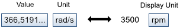

# Scientific Data Format

The Scientific Data Format (SDF) is an open file format to store multi-dimensional
data such as parameters, simulation results and measurements. It's based on
[HDF5](https://www.hdfgroup.org/hdf5/) which is available on a large number of
platforms. It supports...

- very large files
- up to 32 dimensions
- hierarchical structure
- units, comments and custom meta-information

For detailed information see the [SDF Specification](specification.md).

## Groups, Datasets, Attributes

SDF stores information in *Datasets* that can be structured using *Groups*. Both can
have *Attributes* which are name-value pairs of strings that hold information
about the respective group or dataset.

A hierarchical structure is a good choice for files that contain a large number
of datasets (50+) e.g. simulation results. A flat structure is usually best for
parameter files and intermediate data storage.

## Scales

A special type of dataset is the *Scale* (independent variable): it must be
one-dimensional and its values must be monotonically increasing. One scale can
be attached to every dimension of a dataset.

## Comments and Units

A dataset can store the unit of its value(s). This allows the application to
check if the provided data matches the expected format. Together with the
display unit and the relative quantity datasets can be plotted and edited in a
more intuitive format while preserving the actual value for computations. Both
groups and datasets can also have a comment.

Physical quantities should always be stored in the corresponding SI base or
derived unit e.g. F (farad) for an electrical capacitance or N.m (newton meter)
for a torque.

## License

This document is provided "as is" without any warranty. It is licensed under the
[Creative Commons Attribution 4.0 International license](https://creativecommons.org/licenses/by-sa/4.0/).

----------------------------------------------

Copyright &copy; 2017 Dassault Syst&egrave;mes
